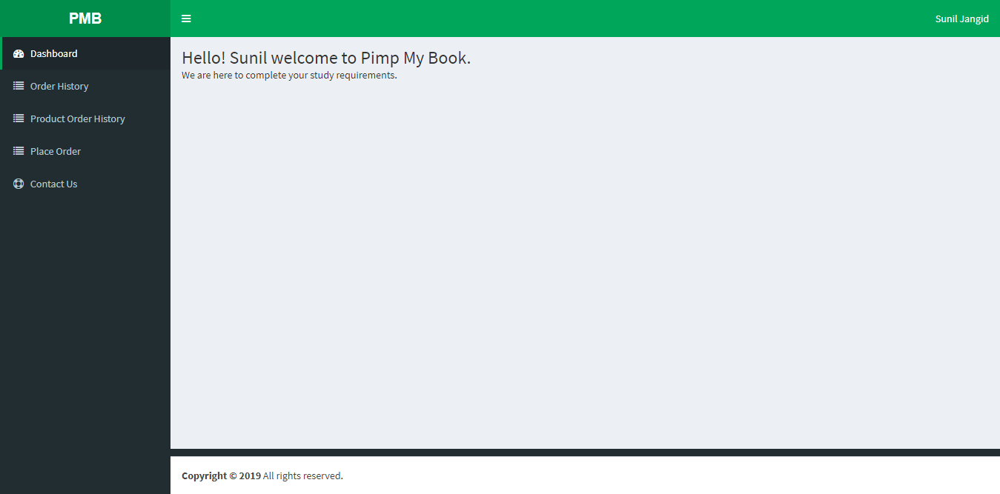
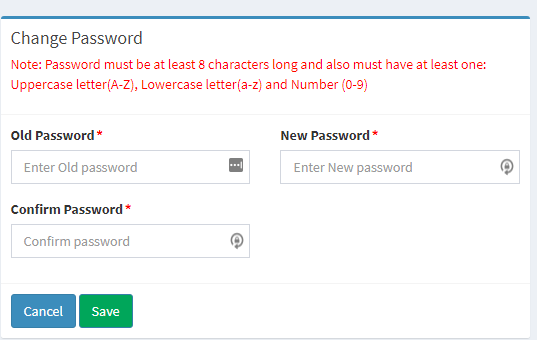

# Change Password

## Goals

Successfully customising your password to your own
Note : The functionality of changing your password is only available once you’ve signed into your profile

### Step 1

On the top right hand corner where your name and surname appears, click once and select profile.

### Step 2

Change your password accordingly with the instructions provided above on the length of your password.

Please note : You will need your previous password to generate your own customised password

### Step 3

Click ‘Save’ to process your new password, or for some reason if no longer want to change your password, click ‘Cancel’

