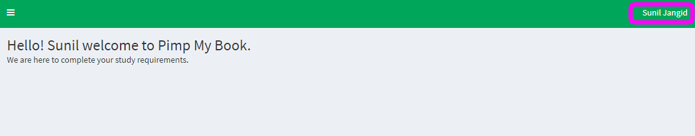

# Change Profile Info

## Goals

Successfully changing your profile details

### Step 1

On the top right hand corner where your name and surname appears, click once and select profile, this will take you to your profile..

### Step 2

Under your profile you able to change your passwords and other personal
information
.

[change_profile_info_step2.png](../uploads/change-profile-info/change_profile_info_step2.png)

You will notice that you are not able to change your sponsor.

### Step 3

Click ‘Save’ to process your updated information, or press ‘Cancel’ if you no longer want to update your information.

