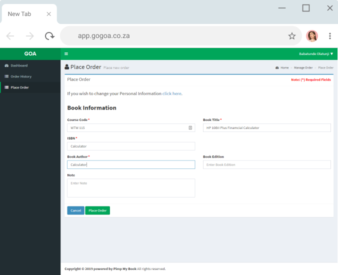

 
# Order A Calculator

## Goals

Place an order for a calculator. Please note this is not the final way to place an order for a calculator we are in the process of releasing a better way for you to order one. 

### Step 1

Proceed to the place order screen as if you were placing an order for a textbook. 

### Step 2

Please go ahead and fill out the form in the following way:

- For the course code, please enter the course you need the calculator for.
- In the "Book Title" field just enter Calculator.
- In the ISBN field, enter the name of the calculator eg: Casio/Sharp
- For the "Book Author" field enter the calculator type: Scientific/Financial/FZA83 plus/Basic calculator
- You can leave the "Book Edition" field blank.
- In the "Note" field just enter "Calculator Order"  

