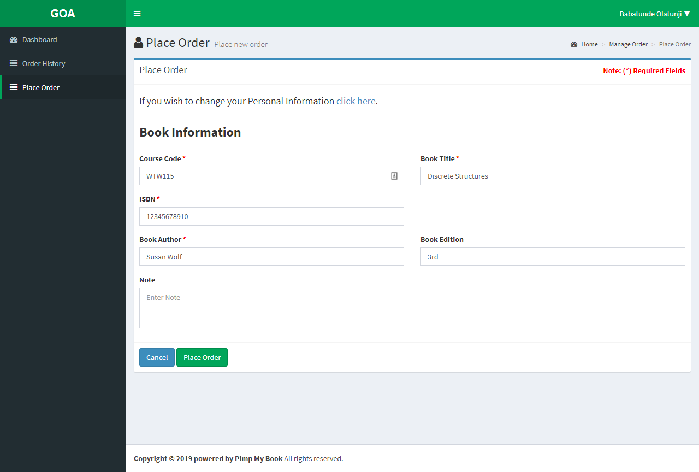

# Place order

## Goals

Successfully placing an order on GOA
Note : You can only successfully place an order as a registered student of our bursary client base once you’ve signed up. 

### Step 1

![place_order_step1.png] (../uploads/place-order/place_order_step1.png)

After logging in you will land on your dashboard. You Should be able to see a `Place Order` button in the side nav and on the page. Click either one to be redirect to the `Place Order` screen.

### Step 2

Now you can go head an fill out the form by telling us what the Course Code, Book Title, ISBN, Book Author and Book Edition is for your order. If there is anything else you need to tell us, simply just tell us in the Note textarea. Once you're done click the place order button.

### Step 3

To check the status of the order simply go to the Order History Page. This is where you can see the progress of all your orders.

