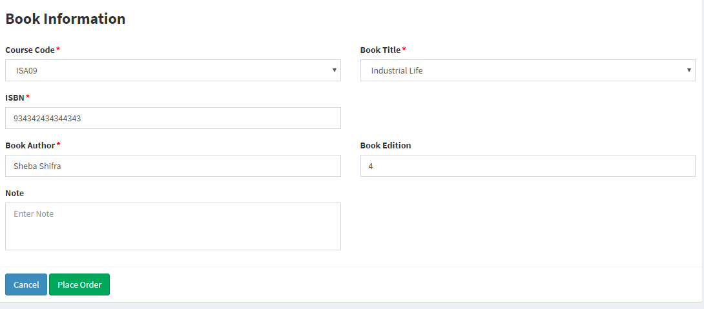

# Place order

## Goals

Successfully placing an order on GOA
Note : You can only successfully place an order as a registered student of our bursary client base once you’ve signed up. 

### Step 1

After logging in you will land on your dashboard. You Should be able to see a `Place Order` button in the side nav and on the page. Click either one to be redirect to the `Place Order` screen.

### Step 2

Select an Order Type – Select whether you want to order a textbook, calculator, laptop, drawing board, lab coat, bag etc. Note that this will be limited to items that were approved by your bursary. Select Book for ordering a book.

### Step 3

To check the status of the order simply go to the Order History Page. This is where you can see the progress of all your orders.

