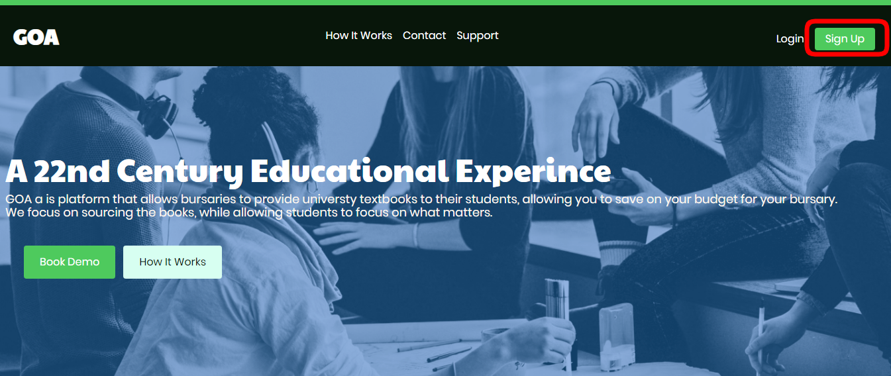
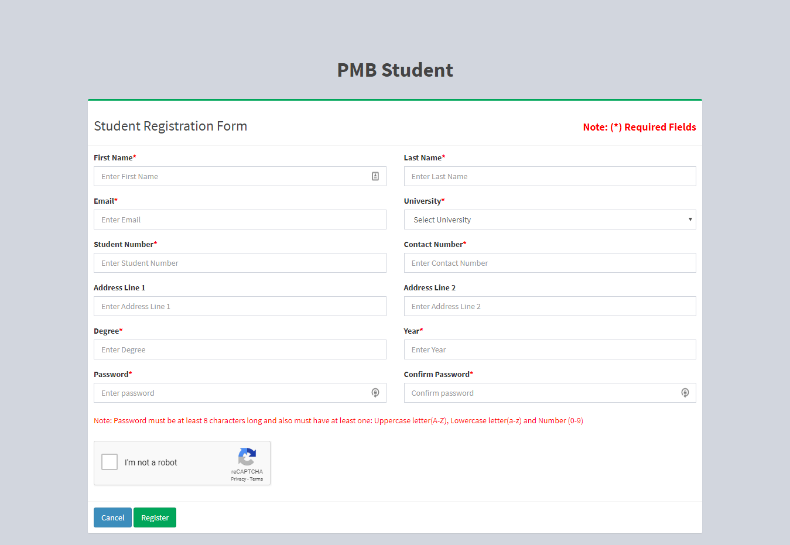
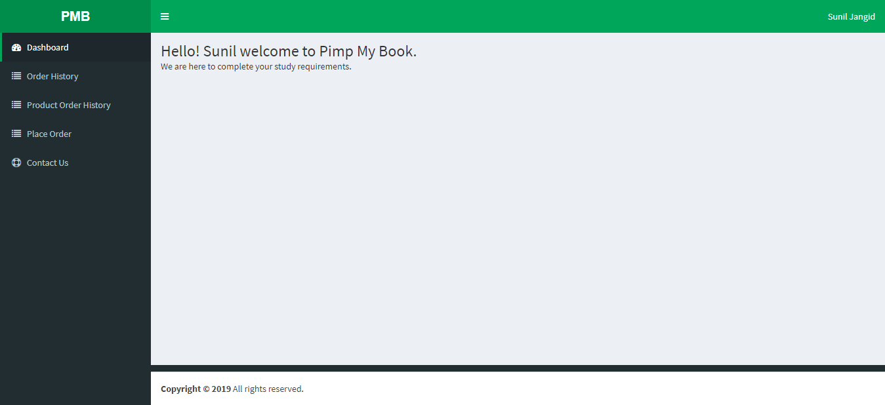

# Sign Up

## Goals

Successfully sign up to GOA
Note you can only sign up if your bursary is a registered client of Pimp My Book and you are registered student of that bursary.

### Step 1

To sign up you need to go to gogoa.co.za and press the sign up button as shown below: 

### Step 2

Once on the sign up form, please enter your details on the form:

You must complete all the required fields.
In the “year” field please put in your current year of study within your
qualification. So if you are in first year put 1....

Note: Only students who have been approved by a particular bursary client
can register on GOA. GOA will check if you are on one of the student lists for
our clients before allowing you to complete the registration.
If GOA does not allow you to register please contact us via email so that we
can check and sort it out.

### Step 3

After signing up you will now be redirected to your dashboard, which means you are successfully registered!

